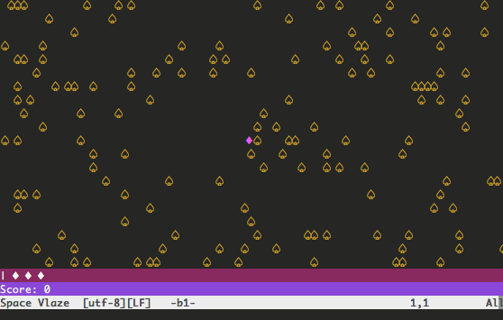

vim-space-vlaze
===============

A space shooter game for Vim. Currently alpha with certain planned features not
yet implemented.

Here's an idea of what the gameplay looks like:

## Requirements
[mplayer](http://www.mplayerhq.hu/): to play game audio

## Installation
Install using any of the various Vim plugin managers. If you use
[pathogen](https://github.com/tpope/vim-pathogen), you can run the following to
install:

	cd ~/.vim/bundle
	git clone https://github.com/teddywing/vim-space-vlaze.git

## License
Licensed under the MIT license. See the included LICENSE file.
